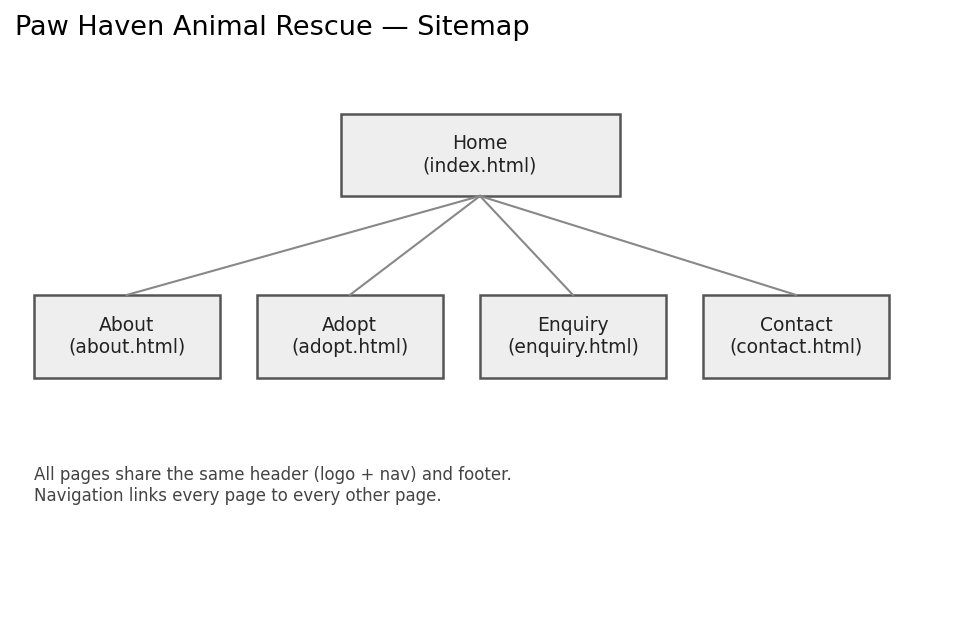

# Paw Haven Animal Rescue — Website Project

## Student Information
- Name: Donald
- Student Number: ST10512213
- Module: Web Development (Introduction) —  WED5112POE
- Institution: The Independent Institute of Education (The IIE), Rosebank College

## Project Overview
Paw Haven Animal Rescue is a fictional non-profit animal shelter based in Johannesburg,
selected as the subject organisation for this Proof of Evidence (POE). The project is a
5-page static website built progressively across three parts of the module: HTML foundation
(Part 1), CSS styling and responsive design (Part 2), and JavaScript functionality and SEO
(Part 3). This README currently documents **Part 1 only**.

## Website Goals and Objectives
- Increase visibility of adoptable animals to raise adoption rates.
- Grow one-off and recurring donations through a clear, trustworthy online presence.
- Recruit volunteers for shelter and event-based roles.
- Provide an easy way for the public to enquire before visiting, adopting, volunteering, or sponsoring.

**Key Performance Indicators:**
- Number of enquiry-form submissions per month.
- Number of volunteer sign-up enquiries per month.
- Time users spend browsing the adoptable-animals content.

## Key Features and Functionality
- Home page with a mission introduction and clear calls to action.
- About page with organisational history, mission, vision, and team.
- Adopt page listing animals currently available for adoption (fulfils the brief's
  required Services/Products page for this organisation).
- Enquiry page with a form supporting adopt / volunteer / sponsor enquiries, as required
  for a non-profit organisation.
- Contact page listing two locations (main shelter and weekend adoption-event venue) and
  a contact form.

## Timeline and Milestones
- Week 1–2: Proposal drafting, research, and lecturer approval (Part 1).
- Week 3–4: Wireframes, sitemap, folder structure, and HTML foundation (Part 1).
- Following submission: CSS styling and responsive design (Part 2).
- Following submission: JavaScript functionality, forms, and SEO (Part 3).

## Part 1 Details

### Organisation Selection
Two proposals were developed and submitted for lecturer approval: **Paw Haven Animal
Rescue** (non-profit) and **Kelder & Vine** (small business). Paw Haven was selected as
the stronger option for the full POE, since its enquiry-form requirements, adoptable-animal
content, and future dynamic/search functionality (Part 3) map more directly onto the
module's rubric than a standard small-business catalogue site. See the Website Project
Proposal document for both proposals in full and the selection rationale.

### Content Research and Sourcing
- Organisational content (history, mission, vision, animal profiles) is original content
  written for this fictional organisation and does not require citation.
- [page-content-sources.md](page-content-sources.md) for a full breakdown of
  what content on each page is original versus sourced.
- No external text content has been copied from any source; all page copy is original.

### Sitemap
   a 4-page hierarchy under a Home page, matching the file
structure below. All pages link to all other pages via a shared navigation menu.

### File and Folder Structure 
```
paw-haven-website/
├── index.html
├── about.html
├── adopt.html
├── enquiry.html
├── contact.html
├── css/
│   └── 
├── js/
│   └──  
├── images/
│   └── (graphics + sitemap.png and more )
├── page-content-sources.md
├── README.md
└── CHANGELOG.md
```

## Changelog
See [CHANGELOG.md](CHANGELOG.md).

## References
the two proposals are listed in the Website Project Proposal
document. is repeated here per the brief's requirement to compile all references in
this README:

xneelo. 2026. Domain Name Search and Registration. [Online]. Available at:
https://xneelo.co.za/domains/ [Accessed 11 August 2026].
thats were i learned and took same of the code 

https://www.w3schools.com/html/html_formatting.asp( used to learn HTML and get code from there )

Microsoft, 2026. Microsoft Word (created the wireframes) & https://www.drawio.com/
website images

Paw Haven logo
Mudzani, D. 2026. Paw Haven Animal Rescue logo. [Personal drawing]. Pretoria: Unpublished.(The graphic was generated with the assistance of an AI image-generation tool for use as an original project asset.)

Main shelter image
Mudzani, D. 2026. Paw Haven main shelter illustration. [Personal drawing]. Pretoria: Unpublished.(The graphic was generated with the assistance of an AI image-generation tool for use as an original project asset.)

Weekend adoption venue image
Mudzani, D. 2026. Paw Haven weekend adoption event venue illustration. [Personal drawing]. Pretoria: Unpublished.(The graphic was generated with the assistance of an AI image-generation tool for use as an original project asset.)


1. iStock — Learning about Cat Care
iStock by Getty Images. n.d. Learning about Cat Care at an Animal Shelter [Photograph]. Available at: https://www.istockphoto.com/photo/learning-about-cat-care-at-an-animal-shelter-gm2151854408-572911823 (Accessed: 14 August 2026

2. Block Club Chicago — puppy and kitten
One Tail at a Time. 2024. Rescued puppy and injured kitten in foster care [Photograph]. In: Perez, R. Rescued Puppy and Injured Kitten Become Best Friends In Foster Care. Now, They Need A Forever Home. Block Club Chicago, 30 August. Available at: https://blockclubchicago.org/2024/08/30/rescued-puppy-and-injured-kitten-become-best-friends-in-foster-care-now-they-need-a-forever-home/ (Accessed: 14 August 2026).

3. iStock animal-shelter search page
iStock by Getty Images. n.d. Animal shelter images and stock photos. Available at: https://www.istockphoto.com/search/2/image-film?phrase=animal+shelter (Accessed: 14 August 2026).


 This list will be updated as further
sources (e.g. sourced images, code references) are added in Parts 2 and 3.
